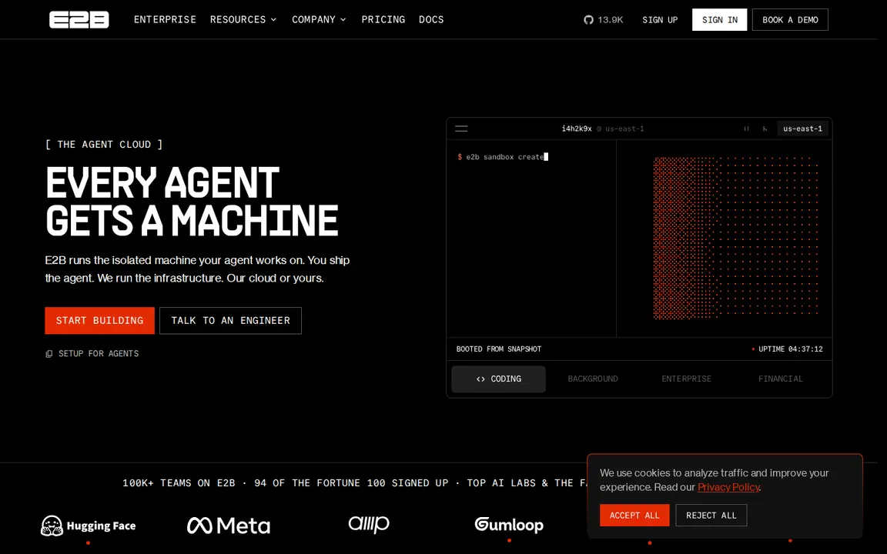
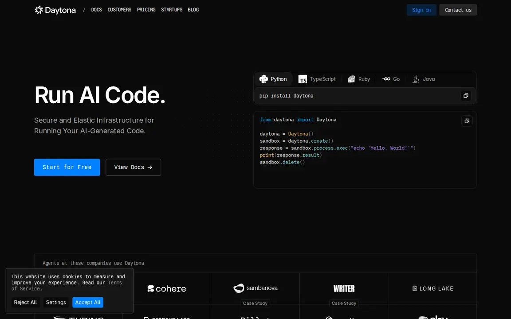
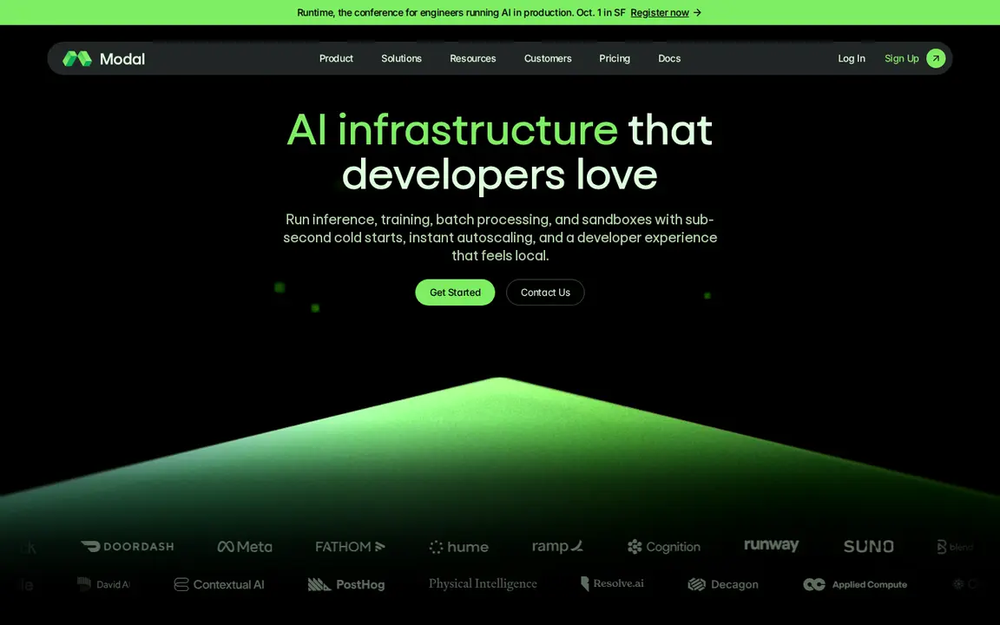
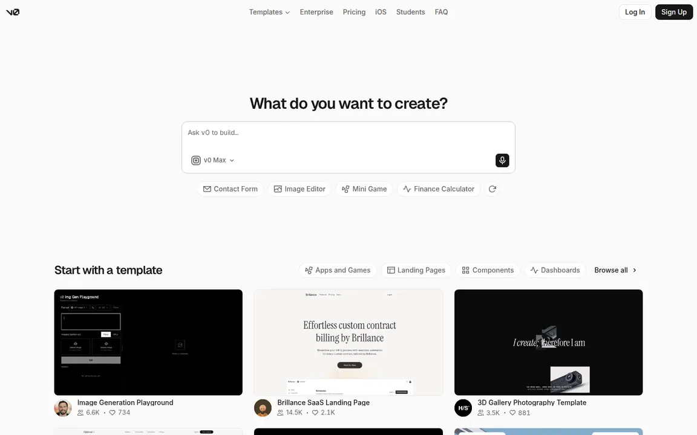
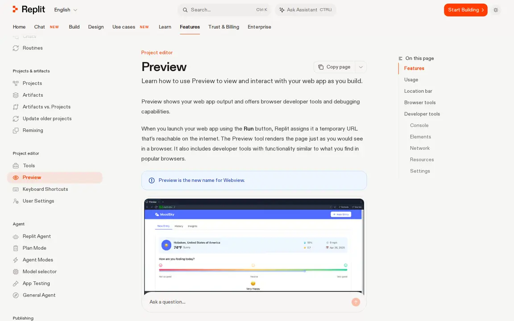
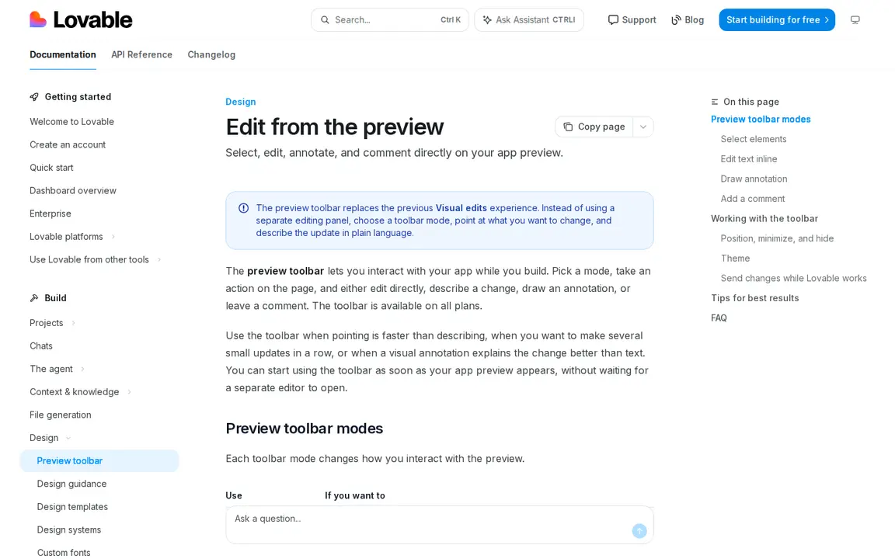
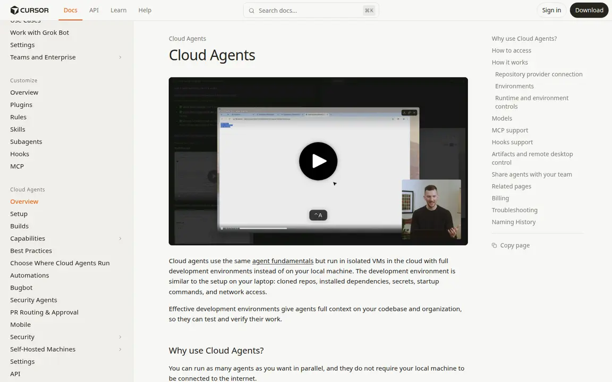

# Sandbox UI design reference teardown

**Decision for Sandbox product teams:** make the selected runtime, its current work, and its inspectable output the center of the workspace.
Chat can direct work, but a file, preview, terminal, log, or result should become the main surface when the task calls for it.
This extends the existing [UI direction](../UI-DIRECTION.md) into review criteria for the component and flow audit.

## Evidence and limits

I inspected public pages in Chromium on 2026-09-23 at 1440 × 900 and 390 × 844 CSS pixels.
The screenshots below are captures of those pages, not mockups or proof of signed-in product behavior.
E2B, Daytona, Modal, and v0 exposed useful public first views.
Replit and Lovable blocked anonymous browser access, while Cursor's agent URL stopped at a verification page.
For those three products, I used official product documentation and captured the documentation pages instead.
The cited docs establish documented behavior; the screenshots establish only the visible public composition.
No authenticated competitor task, accessibility audit, or performance comparison was run.

| Reference | Browser evidence | Behavior source | Source class |
| --- | --- | --- | --- |
| [E2B](https://e2b.dev/) | [desktop](screenshots/design-references-2026-09/e2b-desktop.webp), [mobile](screenshots/design-references-2026-09/e2b-mobile.webp) | [E2B Embed dashboard](https://github.com/e2b-dev/runtime/blob/main/embed/README.md) | Public page: inspiration; maintained runtime README: product evidence |
| [Daytona](https://www.daytona.io/) | [desktop](screenshots/design-references-2026-09/daytona-desktop.webp), [mobile](screenshots/design-references-2026-09/daytona-mobile.webp) | [Playground](https://www.daytona.io/docs/en/playground/), [web terminal](https://www.daytona.io/docs/web-terminal) | Public page: inspiration; official docs: product evidence |
| [Modal](https://modal.com/) | [desktop](screenshots/design-references-2026-09/modal-desktop.webp), [mobile](screenshots/design-references-2026-09/modal-mobile.webp) | [Developing and debugging](https://modal.com/docs/guide/developing-debugging), [deployment history](https://modal.com/docs/guide/managing-deployments) | Public page: inspiration; official docs: product evidence |
| [Vercel v0](https://v0.app/) | [desktop](screenshots/design-references-2026-09/v0-desktop.webp), [mobile](screenshots/design-references-2026-09/v0-mobile.webp) | [Sandbox](https://v0.app/docs/sandbox), [deployments](https://v0.app/docs/deployments) | Public product start: product evidence; official docs: product evidence |
| Replit | [Preview docs capture](screenshots/design-references-2026-09/replit-docs.webp) | [Preview](https://docs.replit.com/features/editor/preview), [task board](https://docs.replit.com/features/agent/task-board) | Official docs: product evidence; live app not observed |
| Lovable | [Preview toolbar docs capture](screenshots/design-references-2026-09/lovable-docs.webp) | [Preview toolbar](https://docs.lovable.dev/features/preview-toolbar), [publish](https://docs.lovable.dev/features/publish) | Official docs: product evidence; live app not observed |
| Cursor web | [Cloud Agent docs capture](screenshots/design-references-2026-09/cursor-docs.webp) | [Cloud Agents](https://cursor.com/docs/cloud-agent), [agent overview](https://cursor.com/docs/agent/overview) | Official docs: product evidence; live app not observed |

The public first views use four distinct hierarchies.
E2B uses an oversized uppercase display beside a terminal illustration, with sparse spacing and an orange primary action.
Daytona uses a two-column layout with smaller display type, a code sample, and a blue primary action.
Modal centers its heading and action over a wide green abstract shape; the first view has no inspectable product artifact.
v0 uses a narrow centered request field on white, then gives examples and template previews the next visual tier.
The desktop layouts fit within wide page margins; E2B and Daytona stack their media below actions on mobile.
The static captures do not establish motion behavior, so animation is not part of the recommendation.

## What transfers

### E2B: the machine is the product object

The public first view pairs one strong claim with a terminal-shaped machine artifact.
Its mobile view keeps the claim and actions readable before the machine moves below them.
E2B's self-hosted dashboard documents a sandbox list, templates, a terminal, and a filesystem inspector.
That establishes a useful product object: one selected machine with several ways to inspect it.

**Adopt:** keep sandbox identity, lifecycle state, and access scope visible while users switch between terminal, files, and preview.
Open the exact file or command produced by a run from its event in the timeline.
**Avoid:** copying terminal art, uptime numbers, or a dark industrial palette when those marks are not real runtime state.

### Daytona: different tools, one active sandbox

The public first view pairs its claim with a small runnable SDK example.
Its mobile layout stacks the action and code example without hiding the primary action.
Daytona's Playground documents Sandbox, Terminal, and VNC tabs that operate on the same active sandbox.
Its sandbox configuration can also produce code snippets from the chosen values.

**Adopt:** bind each workspace mode to the same selected sandbox and show the mode's real controls.
A terminal needs command input; a preview needs an address and reload; a file needs inspection and editing controls.
**Avoid:** tabs that switch only the heading while leaving the same generic chat input underneath.
Do not show a VNC or code mode unless the consumer can execute it.

### Modal: operational evidence belongs one click from the run

The public landing view uses a bright brand field, but it does not show enough application state to define the runtime UI.
Modal's product docs describe an App page with application and system logs, CPU, RAM, GPU, and call history.
The CLI prints a direct link to that App page, and deployment history supports rollback.

**Adopt:** make a run receipt openable from its command result or agent event.
Put failures, timestamps, logs, resource data, and previous versions near the affected run.
**Avoid:** a dashboard of decorative metrics when users need the exact failed call and its evidence.
Do not transfer the landing page's glow into operational status styling.

### Vercel v0: intent first, then a shared working environment

The public start view gives the request field the most space, with examples and templates below it.
On mobile, that order remains clear without a second navigation system in the first view.
The v0 docs say each chat owns a sandbox with a Preview tab, logs, terminal, and code editor on one filesystem.
The docs also separate the working sandbox from production deployment.

**Adopt:** begin a new task with a clear input, then promote the resulting artifact into a workbench.
Keep preview, code, and logs tied to the same run and distinguish working state from published state.
**Avoid:** making a large composer the dominant surface after users need to inspect or verify an artifact.
Do not imply that a successful preview means the deployed app is live.

### Replit: a preview is a test surface

Replit's Preview docs show an interactive app view with device presets, developer tools, and a temporary URL.
Its task board docs separate planned, active, ready, and applied work.
The visible documentation capture includes a real Preview screenshot, but the signed-in editor was not accessible here.

**Adopt:** attach a usable preview and its URL to the work it tests.
Expose responsive sizes and errors where a builder can act on them.
Give planned, running, reviewable, and applied work distinct states.
**Avoid:** adding every editor tool to the default shell before the user has a task that needs it.

### Lovable: point at the artifact to explain a visual change

Lovable documents preview modes for selecting elements, editing text, drawing an annotation, and commenting.
Each mode changes how the user acts on the preview, and unfinished edits must be sent or discarded before switching.
The docs keep publishing as a separate action from editing.

**Adopt:** let preview users point to an element or area when a written description is ambiguous.
Match the control to the action, keep draft edits visible, and require an explicit publish action.
**Avoid:** adding visual editing affordances to terminal, log, or file surfaces where pointing has no clear meaning.
Do not silently turn an annotation into a verified code change.

### Cursor web: finish with reviewable work

Cursor documents cloud agents that produce diffs, pull requests, screenshots, videos, logs, and a remote desktop.
Its agent overview also documents checkpoints and ways to steer running work.
The Cloud Agent docs page displays a product media frame, but the signed-in agent UI was not accessible here.

**Adopt:** a completed coding run should link to the changed files and the evidence used to check them.
Keep interruption, follow-up, and review actions close to the active run.
**Avoid:** forcing repository and PR controls into non-code Sandbox consumers.
Show only the evidence and actions supported by the current task.

## Direction for Sandbox UI

These references support a workspace with one selected runtime and a task-specific main surface.
The runtime header should show actual identity, lifecycle state, elapsed time, and a stop or failure reason when present.
The main surface should show the selected artifact: preview, file, terminal, graph, result, or execution history.
The agent timeline should open the artifact or log line created by each event.
An explicit review boundary should separate generated output from checked results and published state.

On desktop, the current [workspace shell direction](../UI-DIRECTION.md) can use parallel task and artifact panes.
On mobile, keep one primary pane visible and make the other panes reachable without losing selected runtime context.
Use the existing brand tokens and semantic states instead of importing a competitor's palette.
Visible activity must correspond to real work; an idle skeleton or invented status should never imply progress.

The next rebuilds should prioritize the surfaces that make this model fail in a real task.
That means broken artifact opening, unclear run state, inaccessible controls, clipped mobile content, and hidden errors come before decorative refinements.

## Quality rubric for the component and flow audit

Score each of the 96 components and five main product flows out of 10.
Use **2/10 as the initial assumption**, then replace it with a score supported by evidence.
Score the actual rendered state in Storybook or a consumer, not source code alone.

| Dimension | Points | A full score requires |
| --- | ---: | --- |
| [WCAG 2.2 AA](https://www.w3.org/TR/WCAG22/) | 0–2 | Relevant AA criteria pass in the tested states, including names, contrast, status messages, target size, and focus visibility. |
| [Keyboard use](https://www.w3.org/WAI/ARIA/apg/practices/keyboard-interface/) | 0–2 | Every core action works without a pointer; focus order, widget keys, escape, return focus, and no-trap behavior work. |
| [Responsive behavior](https://www.w3.org/WAI/WCAG22/Understanding/reflow.html) | 0–2 | Content and actions remain usable at desktop, mobile, and 320 CSS px reflow without avoidable two-axis scrolling. |
| Visual polish | 0–2 | The primary task and current state are legible at first glance; text fits, hierarchy is clear, and artifacts have enough room. |
| Consistency | 0–1 | The component uses owned tokens, language, states, spacing, and interaction patterns across both themes. |
| [Performance](https://web.dev/articles/inp) | 0–1 | Interaction responds without perceptible blocking; product flows meet the good INP threshold of 200 ms when field data exists. |

Award zero for a dimension with a core failure, half its points for a partial pass, and full points only with the required evidence.
For the one-point dimensions, use 0, 0.5, or 1.
Keyboard has a separate score so the audit records its practical quality; a keyboard WCAG failure still fails the AA gate.
Record the score, the exact state or route, the failed action or criterion, and a screenshot or trace for each finding.
An automated accessibility scan can find defects but cannot establish WCAG conformance by itself.

For each component, inspect relevant default, focus, disabled, loading, empty, error, and overflow states in light and dark themes.
Capture desktop at 1440 × 900, mobile at 390 × 844, and test 320 CSS px reflow.
For each flow, use the real consumer route and exercise success, failure, keyboard operation, and return to work after an interruption.
Use a performance trace or field metric for flows; mark isolated component performance **unmeasured** if no useful interaction exists.
Do not silently convert missing evidence into a pass.

An 8/10 score is the rebuild target, not a waiver for a failed WCAG 2.2 AA criterion or unreachable core keyboard action.
Those failures block acceptance until fixed and rechecked.
