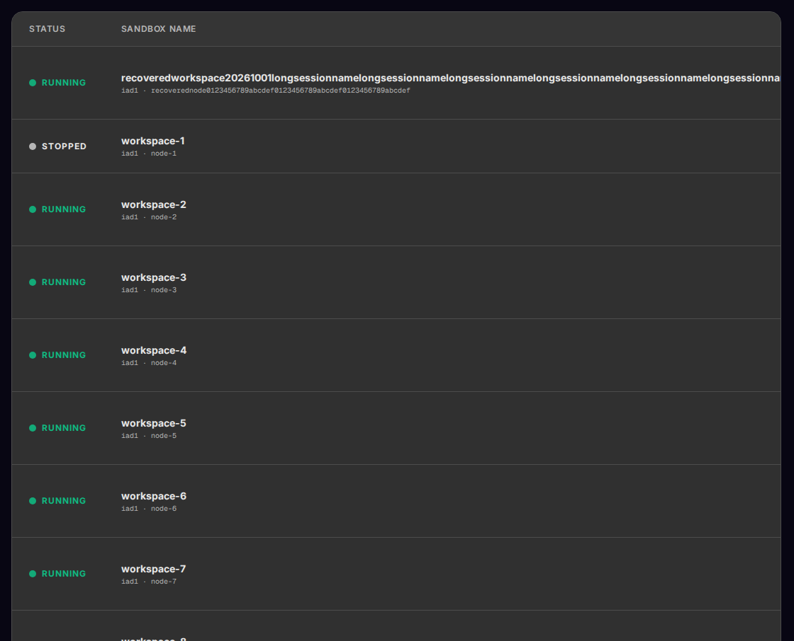
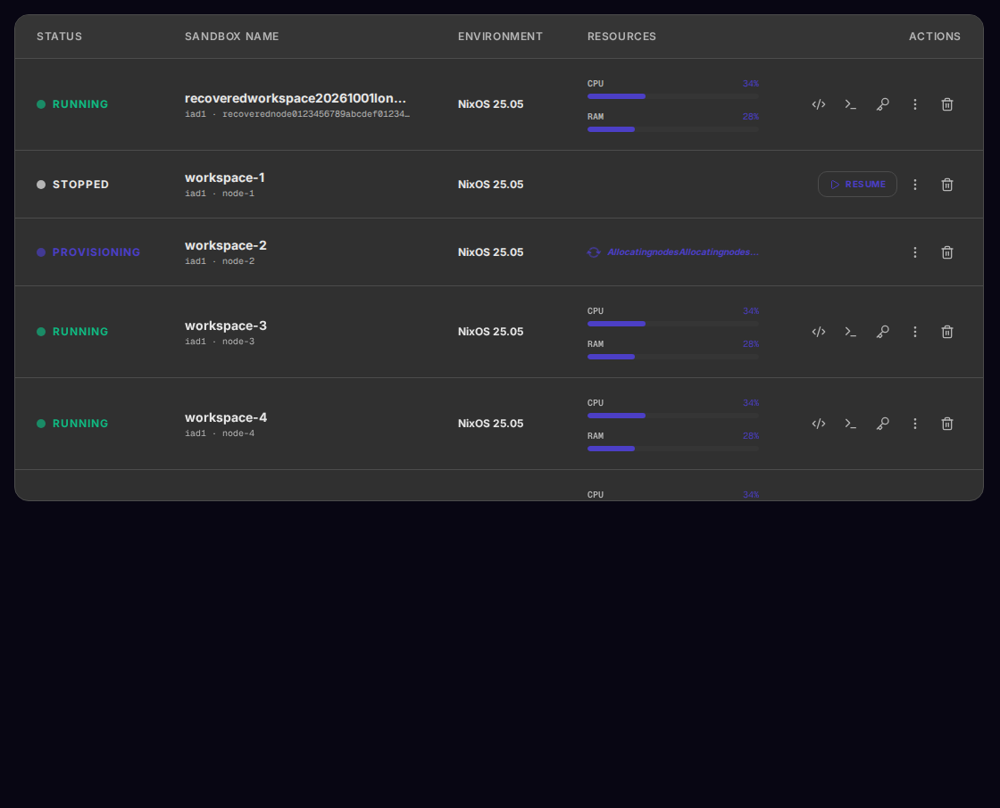
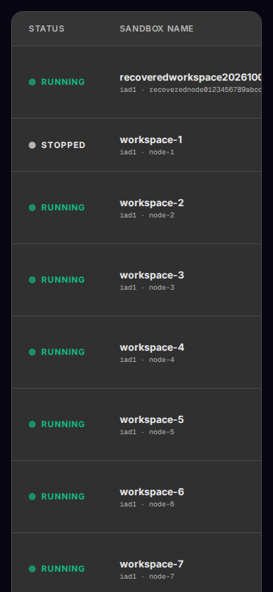
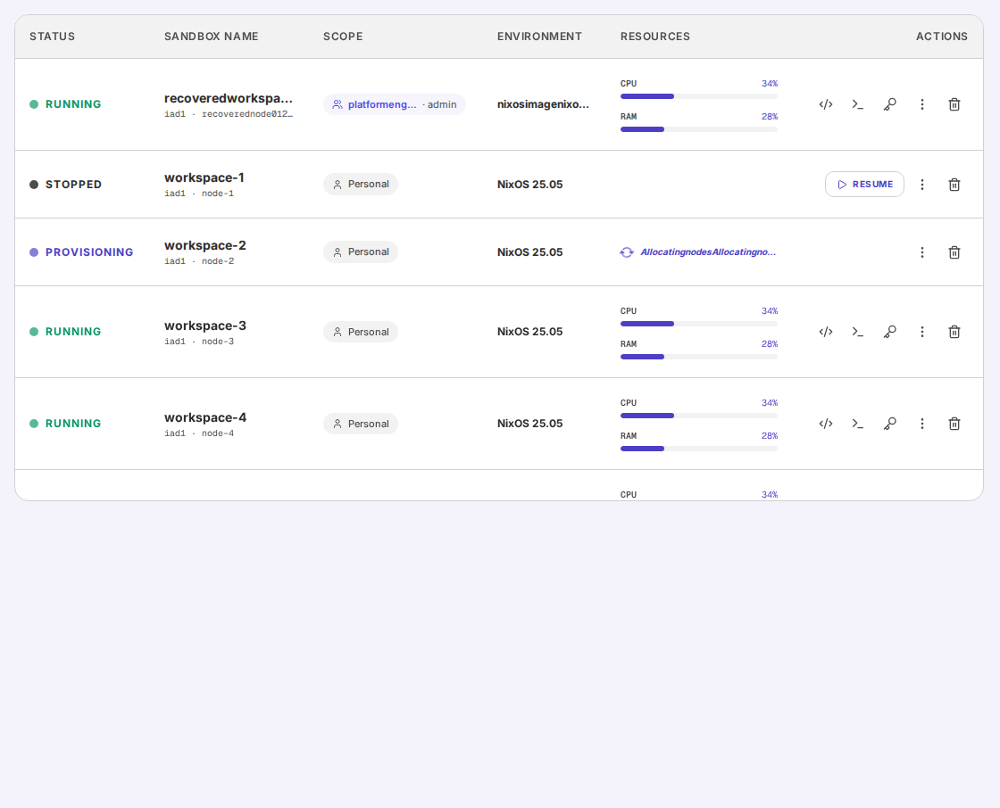
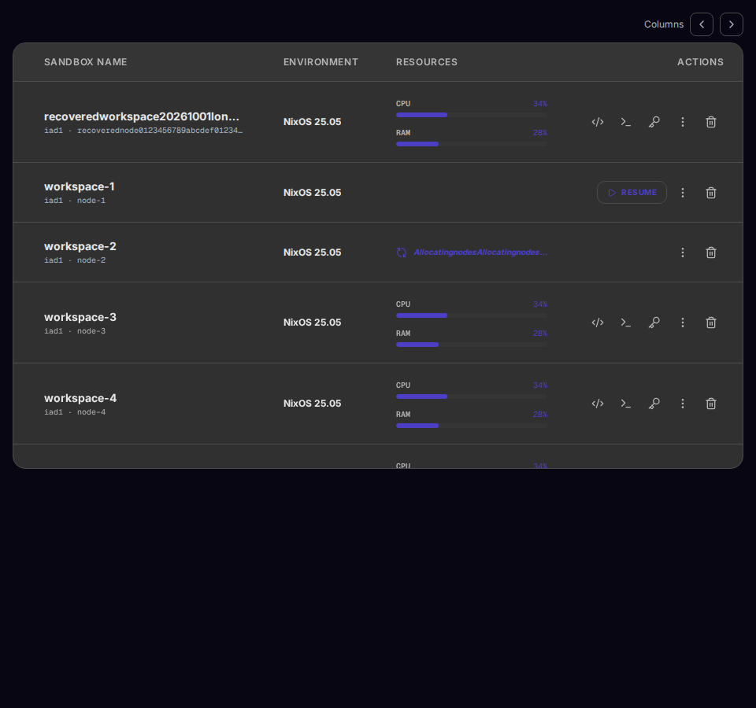
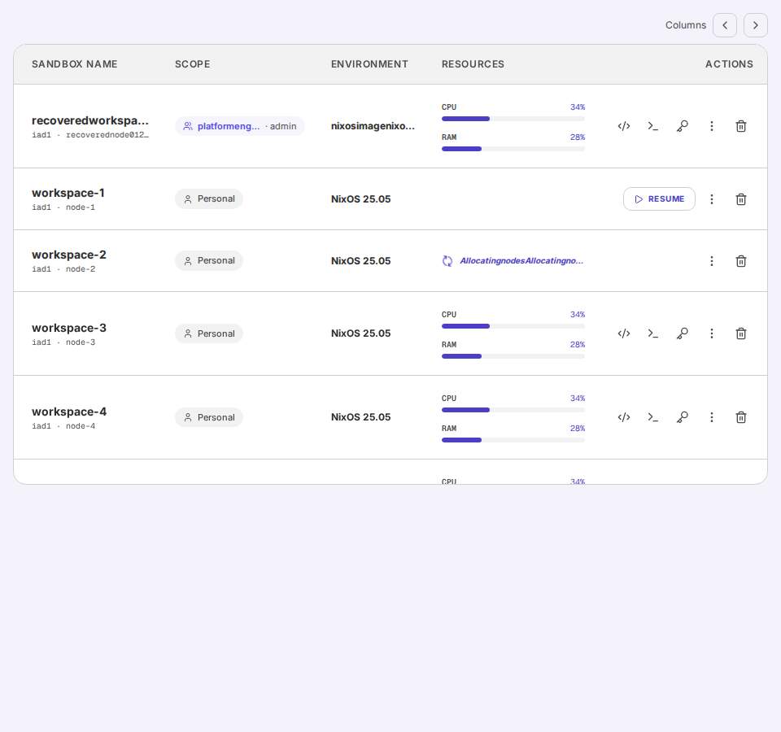

# Sandbox table overflow browser receipt

Source: `fafd15fed51ca4c1363733a7fca9d5e4e5c2f548` (`@tangle-network/sandbox-ui` 0.116.5).
Target: Storybook 10.6 on drew-GTR-Pro, Chromium from Playwright 1.63.
The 50-row fixtures use long unbroken sandbox, node, team, image, and provisioning labels.
The five-column and six-column stories are `dashboard-sandboxtable--long-names` and `dashboard-sandboxtable--long-names-with-scope`.

## Before and after

The before screenshots render the fixture against the unmodified 0.116.4 table component.
The desktop table measured 3211 px inside a 1084 px scroller; Resources and Actions were offscreen.
The product owner separately measured the authenticated Sandbox page at 1359 px inside 1086 px at 1672×906.
That live screenshot remains in the Fleet evidence directory because it came from an authenticated session.

| View | Before | After |
| --- | --- | --- |
| Dark desktop, 1120×906 |  |  |
| Dark mobile, 390×844 |  | [Resources](after-mobile-resources-dark.png) and [Actions](after-mobile-actions-dark.png) after the visible column buttons |

The scoped fixture uses a long team name, an admin role, and a long image label.

| View | Checked image |
| --- | --- |
| Light scoped desktop, 1120×906 |  |
| Dark narrow desktop, 960×900 |  |
| Light scoped narrow desktop, 960×900 |  |
| Light scoped mobile, 390×844 | [Resources](after-mobile-scope-resources-light.png) and [Actions](after-mobile-scope-actions-light.png) after the visible column buttons |

## Browser measurements

| Fixture | Viewport | Table / scroller width | Resources | Actions |
| --- | --- | ---: | --- | --- |
| Long names | 1120×906 | 1084 / 1084 px | Visible without scrolling | Visible without scrolling |
| Long names | 960×900 | 1076 / 926 px | Visible after column button | Visible after column button |
| Long names | 390×844 | 1076 / 356 px | Visible after two column presses | Visible after three column presses |
| Scoped long names | 1120×906 | 1084 / 1084 px | Visible without scrolling | Visible without scrolling |
| Scoped long names | 960×900 | 1069 / 926 px | Visible after column button | Visible after column button |
| Scoped long names | 390×844 | 1069 / 356 px | Visible after two column presses | Visible after three column presses |

The scroll area stayed at 544 px on desktop, 540 px on narrow desktop, and 506 px on mobile while the 50 rows were 5144 px tall.
The header stayed pinned after scrolling 4000 px down the table.
The scroll region accepted keyboard focus, and Right Arrow moved it 40 px in each narrow and mobile run.
Each full sandbox name matched its title and the clipboard text after selecting the DOM text and pressing Control+C.
No browser page errors occurred in the six runs.
The [raw interaction record](interaction.json) retains the measurements and zero-error fields.

## Engineering checks and boundary

- Focused SandboxTable tests: 39/39.
- Full unit suite: 1248/1248 across 87 files.
- Typecheck, package build, and Storybook build: passed.
- Focused Storybook image checks: 24/24 across dark/light and desktop/tablet/mobile.
- One local 0.116.5 tarball passed clean consumer builds for 24 JS and 3 CSS exports, with and without optional peers.
  Its local SHA-256 is `5a16d832d560b49d727be07f2ffcfb2060d9df4cabff083beff4de9eb1d63ae4`.

The browser proof is a local Storybook component flow.
The ADC consumer will repeat the actual product route after it pins the published package.
Manual screen-reader testing and served production verification are outside this local receipt.
